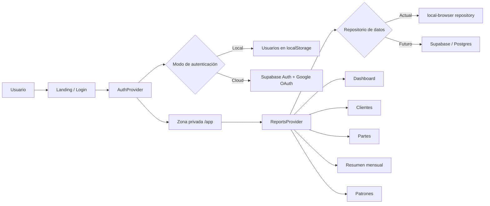
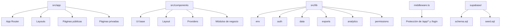
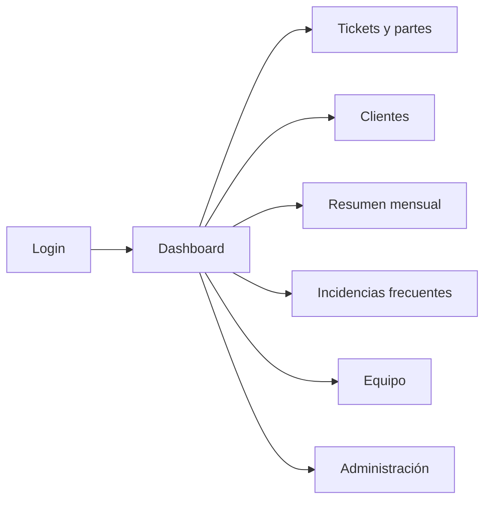
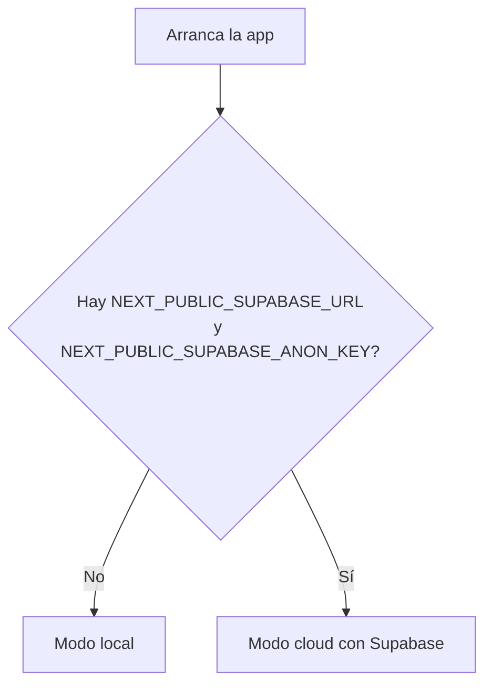
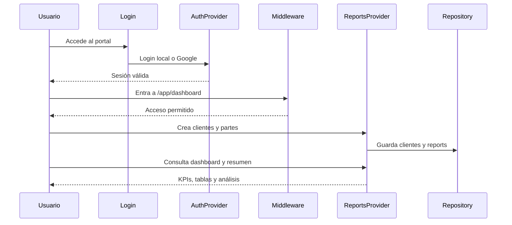

<div align="center">

# WorkingParts

### Portal premium para partes de trabajo, clientes, supervisión técnica y facturación ligera

<p>
  
  
  
  
  
</p>

<p>
  
  
  
  
</p>

<p><strong>WorkingParts</strong> está diseñado para equipos de soporte IT que necesitan registrar trabajo real, organizar clientes, supervisar actividad y preparar la base documental para facturación con una experiencia visual moderna y lista para crecer.</p>

</div>

---

## ✨ Qué hace especial a este proyecto

No es una simple demo de tickets.

WorkingParts combina:

- `landing` premium enfocada a producto real
- acceso seguro con modo local y modo cloud
- panel privado con navegación clara por áreas operativas
- creación de clientes desde cero, sin datos ficticios
- gestión de partes de trabajo con estructura profesional
- exportación a `PDF` y `Excel`
- métricas operativas, resumen mensual y patrones de incidencias
- arquitectura preparada para evolucionar de `localStorage` a backend real

> 🔥 Importante  
> El proyecto ya puede usarse como base seria de un portal interno de servicio técnico y no como simple maqueta visual.

---

## 📚 Tabla de contenidos

- [Visión general](#-visión-general)
- [Experiencia funcional](#-experiencia-funcional)
- [Arquitectura](#-arquitectura)
- [Mapa del producto](#-mapa-del-producto)
- [Stack tecnológico](#-stack-tecnológico)
- [Arranque local](#-arranque-local)
- [Variables de entorno](#-variables-de-entorno)
- [Autenticación](#-autenticación)
- [Persistencia y modelo de datos](#-persistencia-y-modelo-de-datos)
- [Estructura del proyecto](#-estructura-del-proyecto)
- [Flujo de uso](#-flujo-de-uso)
- [Despliegue](#-despliegue)
- [Verificaciones realizadas](#-verificaciones-realizadas)
- [Siguientes mejoras recomendadas](#-siguientes-mejoras-recomendadas)

---

## 🧭 Visión general

WorkingParts es un portal construido con `Next.js 15` para digitalizar la operativa diaria de un proveedor de soporte técnico.

Su propósito es resolver cuatro problemas muy concretos:

| Problema | Cómo lo resuelve |
|---|---|
| Los técnicos trabajan sin trazabilidad elegante | Centraliza tickets, partes y tiempos en una interfaz clara |
| La supervisión no ve contexto operativo | Dashboard, patrones, resumen mensual y vistas ejecutivas |
| Los clientes están desordenados | Alta manual y cartera limpia preparada para crecer |
| La facturación depende de trabajo manual | Exportaciones PDF/Excel y base documental con firma |

### Público ideal

- empresas de soporte IT
- MSP pequeños o medianos
- departamentos internos de sistemas
- responsables operativos que necesitan visibilidad
- proyectos que quieren empezar rápido y evolucionar luego a SaaS

---

## 🖥️ Experiencia funcional

### Áreas principales del portal

| Área | Propósito | Valor real |
|---|---|---|
| `Landing` | Presentación del producto | Imagen premium y entrada clara |
| `Login` | Acceso local o Google | Seguridad y escalabilidad |
| `Dashboard` | Visión general | KPIs, actividad y estado operativo |
| `Tickets y partes` | Registro del trabajo | Documentación técnica y exportación |
| `Clientes` | Gestión de cartera | Alta ordenada, SLA y relación con tickets |
| `Resumen mensual` | Lectura ejecutiva | Facturación, horas y validación |
| `Incidencias frecuentes` | Detección de patrones | Mejora preventiva |
| `Equipo` | Seguimiento interno | Visibilidad sobre la operativa |
| `Administración` | Gobierno del portal | Roles, estructura y evolución |

### Lo que ya viene preparado

- interfaz moderna con `Tailwind CSS` y `Framer Motion`
- navegación premium con panel lateral
- modo local funcional para desarrollo sin depender de terceros
- integración preparada con `Supabase Auth`
- middleware de protección para rutas privadas
- repositorio de datos desacoplado
- exports de negocio listos para generar entregables

> ✅ Buen enfoque  
> La gran virtud del proyecto es que separa muy bien la experiencia visual del producto y la base técnica necesaria para escalarlo.

---

## 🏗️ Arquitectura

### Arquitectura funcional



### Arquitectura técnica



### Decisiones de diseño importantes

#### 1. `Auth` desacoplada de la UI

La autenticación vive en `AuthProvider`, no dispersa por páginas sueltas. Esto simplifica:

- el cambio de proveedor de acceso
- la lectura del estado de sesión
- la protección del flujo de navegación

#### 2. Repositorio de datos con estrategia intercambiable

La interfaz `WorkingPartsRepository` separa la aplicación del almacenamiento real. Eso permite empezar con `localStorage` y migrar después sin reescribir la lógica principal del portal.

#### 3. App Router moderno

El uso de `src/app` encaja con el modelo actual de Next.js y deja una estructura clara entre:

- páginas públicas
- páginas privadas
- callbacks de autenticación
- layouts por área

#### 4. Diseño orientado a producto

No es solo una app funcional. Está trabajada como producto:

- landing potente
- login con identidad visual fuerte
- paneles con jerarquía visual
- lectura clara de KPIs

---

## 🗺️ Mapa del producto

### Rutas principales

| Ruta | Tipo | Descripción |
|---|---|---|
| `/` | Pública | Landing principal |
| `/login` | Pública | Login local y Google |
| `/auth/callback` | Pública técnica | Retorno de OAuth |
| `/app/dashboard` | Privada | Resumen operativo |
| `/app/partes` | Privada | Alta y seguimiento de partes |
| `/app/partes/[id]` | Privada | Detalle de parte |
| `/app/clientes` | Privada | Alta y gestión de clientes |
| `/app/resumen-mensual` | Privada | Vista ejecutiva |
| `/app/incidencias-frecuentes` | Privada | Detección de recurrencias |
| `/app/equipo` | Privada | Supervisión del equipo |
| `/app/admin` | Privada | Backoffice y crecimiento |

### Navegación operativa



---

## ⚙️ Stack tecnológico

### Core

| Tecnología | Uso en el proyecto |
|---|---|
| `Next.js 15` | Framework principal |
| `React 19` | UI y composición de vistas |
| `TypeScript` | Tipado y robustez |
| `Tailwind CSS` | Sistema visual |
| `Framer Motion` | Interacciones y animaciones |

### Negocio y datos

| Tecnología | Uso en el proyecto |
|---|---|
| `Supabase SSR` | Integración server/client para auth |
| `@supabase/supabase-js` | Cliente de autenticación cloud |
| `Zod` | Validaciones |
| `ExcelJS` | Exportación de hojas Excel |
| `jsPDF` | Exportación PDF |
| `Recharts` | Visualización de métricas |
| `TanStack Table` | Tablas avanzadas |

### ¿Por qué este stack tiene sentido?

- `Next.js 15` aporta una base moderna y profesional para producto real.
- `React 19` mantiene la app preparada para el ecosistema más reciente.
- `Tailwind` permite una identidad visual fuerte sin fricción.
- `Supabase` acelera la autenticación cloud sin bloquear una futura evolución.
- `ExcelJS` y `jsPDF` responden a una necesidad muy concreta del negocio: exportar trabajo técnico.

---

## 🚀 Arranque local

### Requisitos

- `Node.js >= 20`
- `npm`

### Instalación

```bash
npm install
```

### Configuración de entorno local

Crea un archivo `.env.local`.

Ejemplo mínimo funcional para trabajar en modo local:

```env
NEXT_PUBLIC_APP_NAME=WorkingParts
NEXT_PUBLIC_SITE_URL=http://127.0.0.1:3000
NEXT_PUBLIC_DEFAULT_THEME=dark
NEXT_PUBLIC_COMPANY_NAME=Ibersoft
NEXT_PUBLIC_DEFAULT_ROLE=technician
WORKINGPARTS_ADMIN_EMAILS=admin@ibersoft.es
WORKINGPARTS_SUPERVISOR_EMAILS=supervisor@ibersoft.es
```

> 💡 Consejo técnico  
> Si no configuras `NEXT_PUBLIC_SUPABASE_URL` y `NEXT_PUBLIC_SUPABASE_ANON_KEY`, la app funciona igualmente en modo local de desarrollo.

### Ejecutar en desarrollo

```bash
npm run dev
```

Abrir:

```text
http://127.0.0.1:3000
```

### Build de producción

```bash
npm run build
npm run start
```

---

## 🔐 Variables de entorno

### Variables disponibles

| Variable | Obligatoria | Uso |
|---|---|---|
| `NEXT_PUBLIC_APP_NAME` | No | Nombre visible de la app |
| `NEXT_PUBLIC_SITE_URL` | Sí | URL base para callbacks |
| `NEXT_PUBLIC_SUPABASE_URL` | Solo cloud auth | Endpoint de Supabase |
| `NEXT_PUBLIC_SUPABASE_ANON_KEY` | Solo cloud auth | Clave pública de Supabase |
| `SUPABASE_SERVICE_ROLE_KEY` | Opcional por ahora | Reservada para evolución server-side |
| `NEXT_PUBLIC_DEFAULT_THEME` | No | Tema por defecto |
| `NEXT_PUBLIC_COMPANY_NAME` | No | Marca visible |
| `NEXT_PUBLIC_DEFAULT_ROLE` | No | Rol inicial por defecto |
| `WORKINGPARTS_ADMIN_EMAILS` | No | Lista de correos admin |
| `WORKINGPARTS_SUPERVISOR_EMAILS` | No | Lista de correos supervisor |

### Ejemplo completo con Supabase

```env
NEXT_PUBLIC_APP_NAME=WorkingParts
NEXT_PUBLIC_SITE_URL=http://127.0.0.1:3000
NEXT_PUBLIC_SUPABASE_URL=https://your-project.supabase.co
NEXT_PUBLIC_SUPABASE_ANON_KEY=your-anon-key
SUPABASE_SERVICE_ROLE_KEY=your-service-role-key
NEXT_PUBLIC_DEFAULT_THEME=dark
NEXT_PUBLIC_COMPANY_NAME=Ibersoft
NEXT_PUBLIC_DEFAULT_ROLE=technician
WORKINGPARTS_ADMIN_EMAILS=admin@ibersoft.es
WORKINGPARTS_SUPERVISOR_EMAILS=supervisor@ibersoft.es
```

### Cómo decide la app el modo de autenticación



---

## 🛡️ Autenticación

### Modos soportados

| Modo | Uso ideal | Estado |
|---|---|---|
| `Local` | desarrollo, validación rápida, demos controladas | operativo |
| `Cloud + Google` | producción o entorno serio con identidad corporativa | preparado |

### Modo local

Cuando no hay configuración de Supabase:

- el portal usa usuarios persistidos en `localStorage`
- permite login manual
- permite registro manual
- es perfecto para validar UX y flujo interno

### Usuarios semilla de desarrollo

| Rol | Email | Password |
|---|---|---|
| Supervisor | `carlos.martin@ibersoft.es` | `demo1234` |
| Técnico | `lucia@ibersoft.es` | `demo1235` |
| Técnico | `diego@ibersoft.es` | `demo1236` |
| Admin | `sara@ibersoft.es` | `demo1237` |

### Modo cloud con Google

Cuando configuras Supabase:

- desaparece el alta manual local
- se habilita `loginWithGoogle`
- la sesión se gestiona con cookies SSR
- `middleware.ts` protege rutas privadas

### Protección de rutas

El middleware actual controla:

- redirección de usuarios no autenticados a `/login`
- salida automática de `/login` a `/app/dashboard` si ya hay sesión

### Configuración de Google OAuth

#### 1. Google Cloud

Crear un `OAuth Client ID` y registrar:

```text
http://127.0.0.1:3000/auth/callback
https://TU-SITIO.netlify.app/auth/callback
```

#### 2. Supabase Auth

En `Authentication > Providers > Google`:

- activar Google
- pegar `Client ID`
- pegar `Client Secret`

#### 3. Site URL y Redirect URLs

```text
http://127.0.0.1:3000
https://TU-SITIO.netlify.app
```

Redirect URLs:

```text
http://127.0.0.1:3000/auth/callback
https://TU-SITIO.netlify.app/auth/callback
```

---

## 🗃️ Persistencia y modelo de datos

### Estrategia actual

La app usa una abstracción de repositorio:

```ts
interface WorkingPartsRepository {
  readonly strategy: "local-browser" | "supabase";
  loadClients: () => Promise<Client[]>;
  saveClients: (clients: Client[]) => Promise<void>;
  loadReports: () => Promise<WorkReport[]>;
  saveReports: (reports: WorkReport[]) => Promise<void>;
}
```

### Qué significa esto en la práctica

- la UI no depende directamente de `localStorage`
- el proveedor de datos puede cambiar sin rediseñar toda la app
- la evolución a backend real ya tiene una base sólida

### Estado actual de persistencia

| Elemento | Estado actual |
|---|---|
| Clientes | persistidos vía repositorio local |
| Partes de trabajo | persistidos vía repositorio local |
| Sesión local | guardada en `localStorage` |
| Auth cloud | preparada con Supabase |

### SQL incluido

La carpeta `supabase/` ya incorpora:

- `schema.sql`
- `seed.sql`

Esto indica que el proyecto ya contempla una transición ordenada a persistencia real.

---

## 🧱 Estructura del proyecto

```text
workingParts/
├── src/
│   ├── app/
│   │   ├── auth/
│   │   ├── login/
│   │   ├── app/
│   │   │   ├── dashboard/
│   │   │   ├── partes/
│   │   │   ├── clientes/
│   │   │   ├── resumen-mensual/
│   │   │   ├── incidencias-frecuentes/
│   │   │   ├── equipo/
│   │   │   └── admin/
│   ├── components/
│   │   ├── auth/
│   │   ├── dashboard/
│   │   ├── layout/
│   │   ├── providers/
│   │   ├── reports/
│   │   ├── shared/
│   │   └── ui/
│   ├── data/
│   ├── lib/
│   │   ├── auth/
│   │   ├── data/
│   │   └── supabase/
│   └── types/
├── supabase/
├── middleware.ts
├── package.json
└── README.md
```

### Qué guarda cada zona

| Ruta | Rol |
|---|---|
| `src/app` | páginas y layouts con App Router |
| `src/components/ui` | componentes base reutilizables |
| `src/components/layout` | sidebar, topbar y shell |
| `src/components/providers` | estado global de auth y datos |
| `src/components/reports` | formularios, tabla y timeline |
| `src/lib/data` | capa repositorio y estrategia de persistencia |
| `src/lib/auth` | resolución de roles |
| `src/lib/supabase` | clientes browser/server de Supabase |
| `src/data/demo.ts` | usuarios semilla y estado inicial |
| `supabase/` | esquema y seed SQL |

---

## 🔄 Flujo de uso

### Flujo principal del usuario



### Flujo de negocio recomendado

1. Crear clientes reales.
2. Registrar tickets y partes técnicos.
3. Consolidar horas y actividad.
4. Revisar incidencias frecuentes.
5. Exportar documentación a PDF o Excel.
6. Evolucionar a backend real si el volumen crece.

---

## 🌐 Despliegue

### Entorno pensado

El proyecto está bien orientado para desplegarse en:

- `Netlify`
- cualquier hosting compatible con `Next.js`

### Ficheros ya presentes

- `netlify.toml`
- `middleware.ts`
- configuración SSR para auth

### Recomendación de despliegue

#### Entorno de staging

- login local o Supabase de pruebas
- dataset controlado
- validación de flujos internos

#### Entorno de producción

- Supabase Auth con Google
- variables seguras en plataforma
- dominio corporativo
- control de accesos por roles y correos

---

## ✅ Verificaciones realizadas

Durante la puesta en marcha local se ha validado:

- `npm install` completado correctamente
- `npm run build` completado correctamente
- la app arranca en local
- respuesta `200` en `http://127.0.0.1:3000`
- detección de entorno mediante `.env.local`

### Resultado del build

El proyecto genera correctamente:

- landing `/`
- login `/login`
- dashboard `/app/dashboard`
- clientes `/app/clientes`
- partes `/app/partes`
- resumen mensual `/app/resumen-mensual`
- incidencias frecuentes `/app/incidencias-frecuentes`
- administración `/app/admin`

> ✅ Buen uso  
> Este README no está escrito a ciegas: el proyecto se ha instalado, compilado y arrancado localmente antes de documentarlo.

---

## 🧪 Calidad actual

### Puntos fuertes

- UI muy cuidada
- navegación coherente
- buen desacoplamiento entre auth, datos y presentación
- base lista para escalar
- producto entendible y con identidad visual

### Riesgos o deuda técnica visible

- persistencia real aún no conectada en producción
- `SUPABASE_SERVICE_ROLE_KEY` todavía no se explota en flujos server-side
- hay dependencias con avisos heredados del ecosistema al instalar
- faltaría una estrategia formal de tests automatizados

---

## 🚧 Siguientes mejoras recomendadas

### Prioridad alta

- conectar persistencia real para clientes y partes
- añadir validación server-side de negocio
- incorporar tests de flujo crítico
- endurecer permisos por rol en más áreas de la UI

### Prioridad media

- subida de adjuntos reales
- firmas persistentes por backend
- filtros avanzados y búsquedas globales
- dashboard más profundo por técnico y cliente

### Prioridad producto

- branding completo por empresa
- multi-tenant real
- facturación mensual automatizada
- auditoría de acciones administrativas

---

## 💡 Resumen ejecutivo

Si necesitas una frase clara para describir el proyecto:

> **WorkingParts es una base sólida y visualmente premium para convertir la operativa diaria de soporte técnico en un portal moderno, trazable y preparado para crecer hacia un producto SaaS real.**

---

## 📌 Comandos rápidos

```bash
npm install
npm run dev
npm run build
npm run start
```

---

## Licencia

Consulta el archivo `LICENSE` del repositorio.
